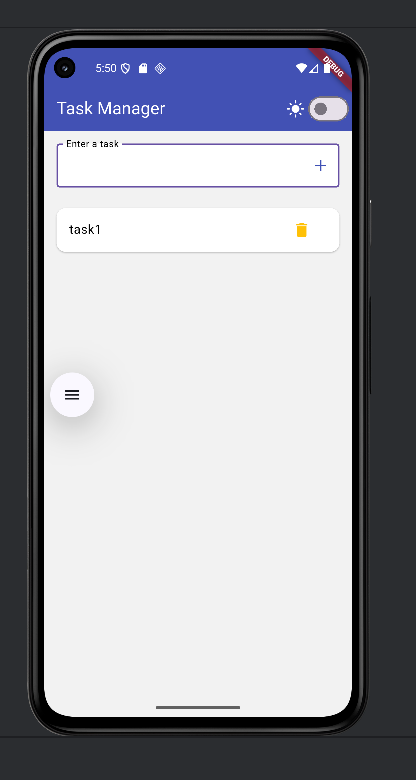

# week3 flutter Intership

A new Flutter project.

## Getting Started
# 📋 Task Manager App

A sleek and functional task management app built with **Flutter**, designed as a final project for Week 3 of the Coursera Programming with JavaScript course. This app allows users to add, delete, and mark tasks as complete, with **persistent data storage** and a toggleable **dark/light theme**.

---

## 🎯 Learning Objectives Achieved

- ✔ Combine JavaScript concepts into a functional Flutter-based app
- ✔ Test navigation, task logic, and persistent storage
- ✔ Debug and refine using Flutter tools
- ✔ Enhance UI with theming and icons

---

## 🚀 Features

- 📝 Add new tasks through a dialog input
- ❌ Delete existing tasks
- ✅ Mark tasks as complete with checkbox toggle
- 💾 Persistent storage using `SharedPreferences`
- 🌗 Dark mode toggle with saved theme preference
- 📱 Responsive UI with styled AppBar, icons, and cards

---
## 🛠 Technologies

- **Flutter SDK**
- **Dart**
- **Shared Preferences Plugin**
- **Material Design Widgets**
---
## 📦 Setup Instructions

1. **Clone the repository**
   Here's a README file for your Flutter Task Manager App:

   

🎯Code Highlights
- SharedPreferences package for persistent data storage
- Custom themes and styles for Material Design Widgets
- Dark mode toggle with theme changes
- TextField widget with custom styles and add task functionality
- ListView.builder widget for displaying tasks

✅What I Learned
- How to use SharedPreferences for persistent data storage in Flutter
- How to create custom themes and styles for persistent data storage in Flutter
- How to implement dark mode toggle with theme changes
- How to use TextField widget with custom styles and functionality
- How to use ListView.builder widget for displaying dynamic data

How to Run
1. Clone the repository
2. Run flutter pub get to get dependencies
3. Run flutter run to start the app
 
 screenshot



Future Improvements
- Add more features to the task manager app (e.g. due dates, reminders)
- Enhance UI design and animations
- Implement more advanced state management

Author
Bakhtawar Alias Rimsha Computer Science Student –  The Shaikh Ayaz University Shikarpur Intern – Flutter App Development


```bash
git clone https://github.com/your-Bakhtawar-Alias-Rimsha/task-manager-app.git
cd task-manager-app


